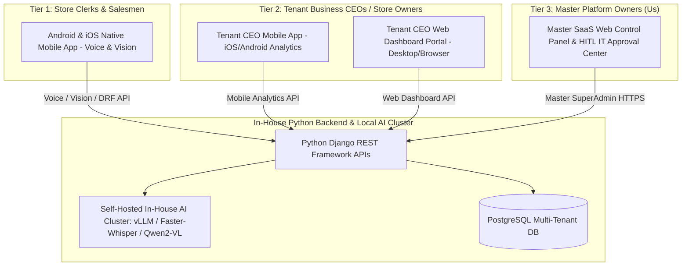
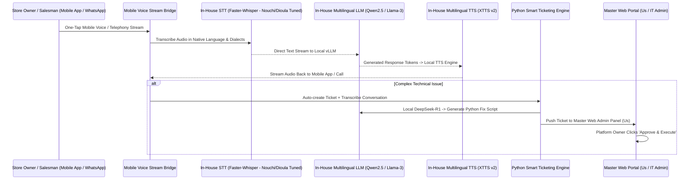

# Master SaaS Platform — Developer Infrastructure & Architecture Specification (Mobile App + Dual Web/App CEO Portal + Master SaaS Admin)

## Technical Architecture Overview
This specification defines the developer implementation details for the **Master SaaS Admin Platform, Autonomous AI Support, and Multi-Tenant Ecosystem**. 

**STRICT COMPLIANCE & TOUCHPOINT ARCHITECTURE:**
1. **Store Clerks & Salesmen:** **100% Mobile App Based** (Cross-platform **Flutter / React Native** app for Android & iOS) featuring native one-tap mic voice recording, instant camera OCR scanning, offline-first local SQLite sync, and native Mobile Money checkout (Wave, Orange Money, MTN MoMo).
2. **Subscribed Business CEOs & Store Owners (Tenants):** **DUAL ACCESS — Mobile App AND Web Dashboard Portal**. Tenant CEOs can monitor real-time sales, staff performance, inventory status, and AI support tickets from either their mobile phone app or any desktop web browser.
3. **Master Platform Admin (Us / Platform Owners):** **Web-Based Master SaaS Control Panel & IT Approval Center** (Django 5.0 + DRF + Responsive Master Admin Portal) for global network metrics, tenant billing, white-label branding, lead hunter campaigns, and Human-In-The-Loop (HITL) IT script approvals.

---

## 1. Touchpoint Architecture & Client Layer

---

## 2. Tiered Client Architecture

### 2.1 Tier 1: Store Clerks & Salesmen (100% Mobile App)
* **Native Audio & Camera Engine:** One-tap voice recording (`record` / `flutter_sound`) and instant camera OCR photo scanning (`camera` package) connected to the in-house `Qwen2-VL` vision endpoint.
* **Offline-First SQLite Caching:** Local SQLite storage caches sales entries, offline stock levels, and voice drafts. Auto-syncs with Django DRF backend when reconnected.
* **Mobile Money Payment SDKs:** One-click in-app checkout supporting Wave, Orange Money, MTN MoMo, and Moov Money.

### 2.2 Tier 2: Subscribed Tenant CEOs & Store Owners (Dual Access: Mobile App + Web Portal)
* **Real-Time Analytics Dashboard:** Real-time store revenue, daily sales charts, top-performing product rankings, inventory alerts, and salesman activity metrics.
* **Responsive Web Portal & Mobile App:** Responsive Web Portal (React / Vue / Django Templates) accessible via desktop browser AND native iOS/Android mobile dashboard app.
* **Store Management & Staff Control:** Add/remove salesman accounts, configure custom store prices, view digital receipts, and audit AI call center support transcripts.

### 2.3 Tier 3: Master SaaS Platform Admin (Us / Platform Owners)
* **Master Web Control Center:** Global real-time dashboard displaying active store counts across countries, total transaction volume, MRR, system health, and self-hosted GPU node loads.
* **White-Label Branding Engine:** Configure custom logos, colors, domain routing (`tenant.clientdomain.com`), and mobile app splash screens per enterprise customer.
* **Human-in-the-Loop (HITL) IT Approval Queue:** Web interface to review, approve, and execute AI-generated Python fix scripts for technical support tickets.
* **AI Lead Hunter Campaign Manager:** Launch and track autonomous prospecting campaigns across global target regions.

---

## 3. Autonomous 24/7 AI Call Center & IT Ticketing System

### 3.1 West African Dialect Tuning & Serving Options
* **Native Nouchi & Dioula Processing:** Unlike 3rd-party APIs (Deepgram Nova-2, Azure TTS, Gemini) which struggle with Ivoirian street slang (*"J'ai gâté 2 sacs de riz"*) and West African trade dialects (Dioula/Jula), our self-hosted `Faster-Whisper` STT and `Qwen2.5` LLM pipeline is explicitly fine-tuned on regional audio patterns.
* **Serving Option 1 (Single-Node FP8 vLLM Engine - $99.00/mo FLAT):** Quantizes `Qwen2.5-7B` (FP8, 5.5 GB VRAM), `Qwen2-VL` (FP8, 6.0 GB VRAM), `Faster-Whisper` (INT8, 1.5 GB VRAM), and `XTTS v2 / Kokoro` (1.5 GB VRAM) into < 15 GB VRAM on a single Hetzner Dedicated GPU AX42 server, yielding **99.66% gross margins**.
* **Serving Option 2 (Multi-Node Redundant Cluster - $194.50/mo FLAT):** Separates Primary GPU (`AX102` @ $119/mo) for unquantized high-concurrency vLLM inference from Web/PostgreSQL node (`CPX31` @ $16.50/mo), delivering **99.33% gross margins** with 99.99% enterprise SLA.
* **Serving Option 3 (Hyper-Optimized 3rd-Party API Bridge - ~$314.67/mo):** Configures DRF API adapters to stream audio directly to Groq Whisper Turbo ($0.04/hr) and Gemini 2.0 Flash ($0.10/1M tokens) as a zero-hardware-maintenance option or emergency automated failover.

---

## 4. Universal Multi-Vendor Inventory & Ecosystem

### 4.1 Mobile App & Web Portal Inventory Management
* **Catalog Browsing:** Fast scrolling list view on mobile app and tabular grid view on CEO web portal with instant voice search and camera photo matching.
* **Dynamic Form Rendering:** Mobile app and Web portal dynamically render input fields based on JSON schemas received from Django DRF endpoints (`attributes` JSONB column).
