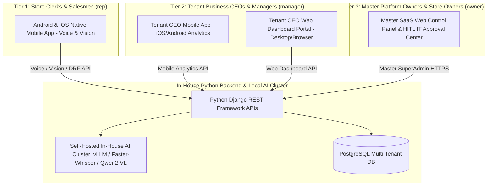
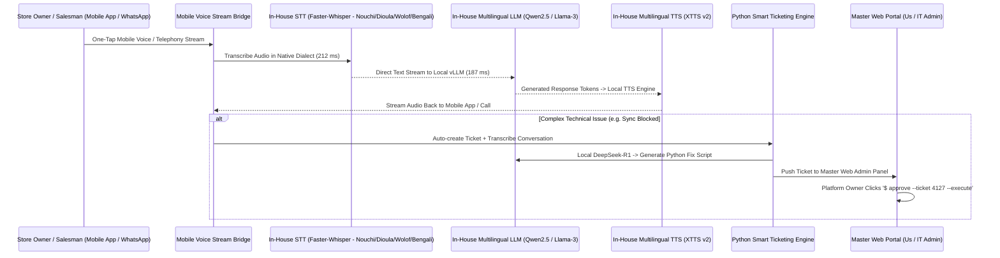

# BOUND OS — Developer Infrastructure & Architecture Specification

## Technical Architecture Overview
This specification defines the developer implementation details for **BOUND OS** ("Country first. Software second.").

**STRICT COMPLIANCE & TOUCHPOINT ARCHITECTURE:**
1. **Store Clerks & Salesmen (`rep`):** **100% Mobile App Based** (Cross-platform **Flutter** app for Android & iOS) featuring native one-tap mic voice recording, instant camera OCR scanning, offline-first local SQLite sync, and native Mobile Money checkout (Wave, Orange Money, MTN MoMo, Moov, bKash, Nagad). Minimum touch target size: 96px for 2-tap sales flow. Permissions: `accView`.
2. **Subscribed Business CEOs & Managers (`manager`):** **DUAL ACCESS — Mobile App AND Web Dashboard Portal**. Tenant managers can monitor real-time sales, staff performance, inventory status, approve/reject transactions, and resolve field requests from either their mobile phone app or desktop web browser. Permissions: `accView`, `accApprove`, `accExport`.
3. **Master Platform Owners & Store Owners (`owner`):** **Web-Based Master SaaS Control Panel & IT Approval Center** (Django 5.0 + DRF + Responsive Master Admin Portal) for global network metrics ($84.3k MRR, 1.2k+ active stores across 3 live regions & 6 pipeline markets), price & commission setting, granular user access control, tenant billing, white-label branding, lead hunter campaigns, and Human-In-The-Loop (HITL) IT script approvals (`$ approve --ticket 4127 --execute`). Permissions: `accView`, `accApprove`, `accPrice`, `accTeam`, `accExport`.

---

## 1. Dynamic Region Engine & Single Codebase Architecture

BOUND OS implements a **"Country First"** architectural pattern:

```
                  +----------------------------------------------+
                  |  JWT Token Payload (Country Code: CI/SN/BD)  |
                  +----------------------------------------------+
                                         |
         +-------------------------------+-------------------------------+
         |                               |                               |
         v                               v                               v
+------------------+           +-------------------+           +-------------------+
| Language & Voice |           | Currency & Digits |           | Payment Rails &   |
| (Nouchi/Dioula/  |           | (XOF FCFA, BDT ৳, |           | Catalog           |
| Wolof/Bengali)   |           | Bengali digits)   |           | (Wave, OM, bKash) |
+------------------+           +-------------------+           +-------------------+
```

* **Single Client Codebase (Flutter):** Zero per-country app builds. A single APK/IPA dynamically adapts language, currency formatting, thousand separators (`sep`), digit scripts (e.g. `০-৯` in Bengali), payment rails, receipt templates, and regional support admin context directly from the merchant's JWT token payload.
* **Backend Isolation (Django + DRF):** Multi-tenant PostgreSQL database where `country` is a top-level column. Regional catalogues, payment gateways, and receipt templates are database rows, not code deployments.

---

## 2. Touchpoint Architecture & Client Layer



---

## 3. Tiered Client & Permission Architecture

### 3.1 Role & Granular Permission Matrix
```python
PERM_KEYS = ['accView', 'accApprove', 'accPrice', 'accTeam', 'accExport']

ROLE_PERMS = {
    'rep': ['accView'],
    'manager': ['accView', 'accApprove', 'accExport'],
    'owner': ['accView', 'accApprove', 'accPrice', 'accTeam', 'accExport'],
}
```

### 3.2 Scope-Based Direct Messaging & Task Delegation Rules (`CAN_SEND`)
* **Sales Rep (`rep`):** Can assign tasks / send messages ONLY to `manager`.
* **Manager (`manager`):** Can assign tasks / send messages to `rep` and `owner`.
* **Owner (`owner`):** Can assign tasks / send messages to `manager` and `rep`.

---

## 4. Offline-First Engine & Local Replay Queue

```
+-----------------------------------------------------------------------------------+
|                               OFFLINE REPLAY QUEUE                                |
+-----------------------------------------------------------------------------------+
| 1. Mobile app writes transaction to local SQLite storage instantly.               |
| 2. Replay queue retains voice notes, camera scans, and cash sales while offline.  |
| 3. Network re-connection triggers idempotent HTTP replay to Django DRF.          |
| 4. Server executes deduplication using UUID idempotency keys.                     |
+-----------------------------------------------------------------------------------+
```

---

## 5. Document Vision OCR Engine (`Qwen2-VL` / `PaddleOCR`)

The Vision engine supports 3 core document types and automatically maps them to actionable business flows:

| Document Type (`scanDoc`) | Document Label | Triggered AI Actions (`scanActions`) |
| :--- | :--- | :--- |
| `delivery` | Delivery Slip (Bordereau) | `actStockIn` (Stock Entry), `actPriceCheck` (Price Verification) |
| `invoice` | Supplier Invoice (Facture) | `actRecordSale` (Record Sale), `actStockIn` (Stock Entry) |
| `card` | Business Card (Carte de visite) | `actSaveContact` (Save Contact), `actAddSupplier` (Add Supplier) |

---

## 6. Autonomous 24/7 AI Call Center & IT Ticketing System



### 6.1 Performance Benchmarks & Serving Topology
* **Faster-Whisper STT Latency:** **212 ms** on self-hosted Hetzner node.
* **Qwen2.5 LLM Latency:** **187 ms** via local vLLM serving engine.
* **Serving Option 1 (Single-Node FP8 vLLM Engine - $99.00/mo FLAT):** Quantizes `Qwen2.5-7B` (FP8), `Qwen2-VL` (FP8), `Faster-Whisper` (INT8), and `XTTS v2` into < 15 GB VRAM on a single Hetzner GPU AX42 server (**99.66% gross margin**).
* **Serving Option 2 (Multi-Node Redundant Cluster - $194.50/mo FLAT):** Dedicated AX102 GPU node ($119/mo) + CPX31 Web/DB node ($16.50/mo), delivering **99.33% gross margin** with 99.99% enterprise SLA.
* **Serving Option 4 (Cloud API Gateway Baseline - ~$1,269.00/mo):** Deepgram Nova-2 ($645/mo) + Gemini 1.5 Flash ($76/mo) + Azure TTS ($480/mo) + Hetzner Cloud ($68/mo).

