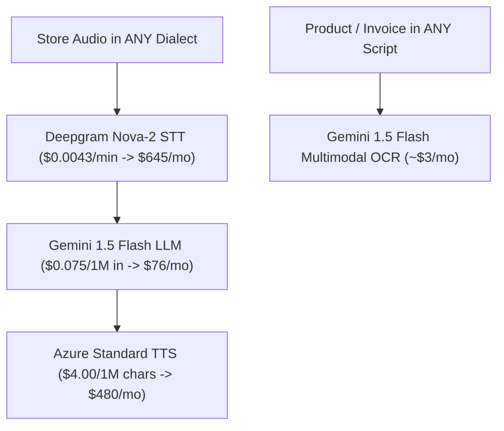

# BOUND OS — Active Cloud API & Infrastructure Cost Matrix

## Executive Summary & Policy
**BOUND OS** operates on an **Active Primary Production Architecture** powered by commercial Cloud APIs (Deepgram Nova-2, Gemini 1.5 Flash, Azure Standard TTS, Gemini Multimodal Vision, Hetzner Cloud CPX VPS & Managed PostgreSQL) at **~$1,269 / month total cost**.

Self-hosted bare-metal GPU model serving (Faster-Whisper, Qwen2.5, Coqui XTTS v2) is maintained as a secondary enterprise option for clients requiring dedicated hardware isolation.

---

## 1. Active Primary Production AI Stack & Cost Matrix (~$1,269 / month)

### 1.1 Active Primary Infrastructure Specification

| Service / Module | Technology Provider | Pricing Structure | Monthly Cost | Operational Capability & SLA |
| :--- | :--- | :--- | :--- | :--- |
| **Speech-to-Text (STT)** | Deepgram Nova-2 | $0.0043 / minute | **$645.00** | High-accuracy 99+ spoken language & dialect audio transcription |
| **Language Model (LLM)** | Gemini 1.5 Flash | $0.075 / 1M in, $0.30 / 1M out | **$76.00** | High-speed multilingual conversational reasoning & intent parsing |
| **Text-to-Speech (TTS)** | Azure Standard TTS | $4.00 / 1M characters | **$480.00** | Natural speech synthesis & voice response generation |
| **Vision OCR** | Gemini 1.5 Flash Multimodal | Included in LLM cost | **~$3.00** | OCR document matching (Delivery slips, invoices, business cards) |
| **Server Hosting** | Hetzner Cloud | CPX series VPS + Managed PostgreSQL | **~$65.00** | Production Web API hosting, multi-tenant DB, Redis broker |
| **TOTAL PRIMARY STACK** | **Active Production Cloud Stack** | **Flat & Usage Hybrid** | **~$1,269.00 / mo** | **Yields 97.2% Gross Margin at $84.3k MRR current scale** |

---

## 2. Secondary In-House & Client Architecture Selection Matrix

> **Pass-Through Cost Notice:** All costs listed below represent **direct 3rd-party pass-through expenses** paid directly to infrastructure providers (Deepgram, Google Cloud, Azure, Hetzner). They are NOT platform software markups.

| Architecture Option | Monthly Pass-Through Cost | Renting / API Cost Line Items | Gross Profit ($84.3k MRR) | Gross Margin % | Technical & Strategic Fit |
| :--- | :--- | :--- | :--- | :--- | :--- |
| **Primary Stack: Commercial Cloud APIs** *(Active Production)* | **~$1,269.00 / mo** | Deepgram Nova-2 ($645) + Gemini 1.5 Flash ($76) + Azure TTS ($480) + Hetzner Cloud ($65). | **$83,051.00 / mo** | **97.2%** | **Active Production Baseline.** Turnkey global SLA reliability, zero GPU server management. |
| **Option 1: Multi-Node Redundant In-House GPU** | **$194.50 / mo FLAT** | Hetzner AX102 GPU Server ($119/mo) + CPX31 Web/DB Node ($16.50/mo) + setup/bandwidth ($59/mo). | **$84,125.50 / mo** | **99.77%** | Secondary enterprise option for hardware isolation across data centers. |
| **Option 2: Ultra-Lean In-House GPU Stack** | **$99.00 / mo FLAT** | Single Hetzner Dedicated GPU AX42 server ($99/mo flat) hosting FP8 vLLM + DB + Web API. | **$84,221.00 / mo** | **99.88%** | Secondary single-node option for minimum hardware flat rates. |
 fail.

