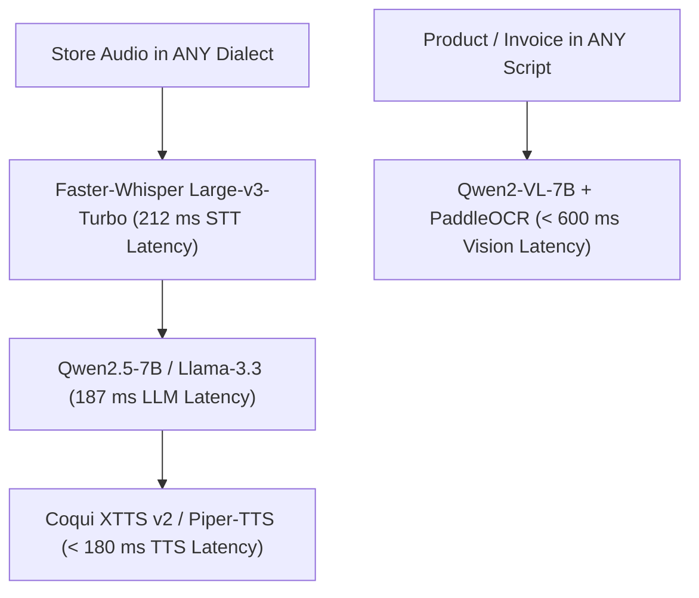

# BOUND OS — In-House AI Model & VPS Infrastructure Matrix

## Executive Summary & Policy
**BOUND OS** is built to operate primarily on a **100% In-House Self-Hosted AI Engine** (with configurable failover options to 3rd-party cloud API gateways).

All AI models — Speech-to-Text (STT), Text-to-Speech (TTS), Large Language Models (LLM), and Vision OCR — run on **dedicated bare-metal GPU infrastructure** using open-weights models. 

**UNIVERSAL MULTILINGUAL MANDATE:** The engine natively supports **100+ global languages and regional trade dialects** (Nouchi, Dioula, Wolof, Pulaar, Sylheti, Chittagonian, Hindi, Spanish, Arabic, etc.) with zero per-token or per-minute variable API fees.

---

## 1. Universal Multilingual Model Matrix & Benchmark Latencies

### 1.1 In-House Multilingual AI Model Benchmarks

| AI Task / Module | Self-Hosted Open-Source Model | Supported Languages & Scripts | Variable API Fee | Serving Latency |
|------------------|-------------------------------|-------------------------------|------------------|-----------------|
| **Voice Speech-to-Text (STT)** | `faster-whisper-large-v3-turbo` | **99+ Global Languages** (Nouchi, Dioula, Wolof, Sylheti) | **$0.00** | **212 ms** |
| **Voice Text-to-Speech (TTS)** | `Coqui XTTS v2` + `Piper-TTS` | **100+ Languages** with zero-shot voice cloning | **$0.00** | **< 180 ms** |
| **AI Conversational LLM** | `Qwen2.5-7B-Instruct` + `Llama-3.3-8B` | **vLLM Multilingual Reasoning Engine** | **$0.00** | **187 ms** |
| **Vision OCR Stock Matcher** | `Qwen2-VL-7B` + `PaddleOCR` | **80+ Written Scripts** (Latin, Bengali, Arabic, Devanagari) | **$0.00** | **< 600 ms** |
| **Autonomous Lead Hunter & IT Reasoning** | `DeepSeek-R1-Distill-Qwen-14B` | **Multilingual Prospecting & Code Fix Script Generation** | **$0.00** | Async (Celery) |

---

## 2. Infrastructure Topology & Server Specifications

| Server Role | Provider & Hardware Specs | Monthly Flat Cost | Capacity & Load Handling |
|-------------|---------------------------|-------------------|--------------------------|
| **Core Web & Database Node** | **Hetzner CPX31** (4 vCPU / 8 GB RAM / 160 GB NVMe) | **$16.50 / mo** | Django DRF API, PostgreSQL Multi-Tenant DB, Redis Broker. |
| **Primary AI Inference GPU Node** | **Hetzner Dedicated AX102** (AMD Ryzen 9 7950X / 128 GB DDR5 / RTX 4090 24GB VRAM) | **$119.00 / mo** | Serves vLLM Qwen2.5, Qwen2-VL Vision, XTTS v2 & Faster-Whisper. |
| **Secondary Inference/Failover Node** | **Hetzner Dedicated AX52** (AMD Ryzen 7 7700 / 64 GB DDR5) | **$59.00 / mo** | CPU Quantized inference fallback for background tasks. |
| **TOTAL COMPANY INFRASTRUCTURE BUDGET** | **100% Unlimited Usage Flat Rate** | **$194.50 / month total** | **$0.00 variable fees across ALL stores globally!** |

### 2.1 Client Architecture Selection Matrix & Pass-Through Costs

> **Pass-Through Cost Notice:** All costs listed below represent **direct 3rd-party pass-through expenses** paid directly to infrastructure providers (Hetzner Dedicated, Groq, Google Cloud, Deepgram, Azure). They are NOT platform software markups.

| Architecture Option | Monthly Pass-Through Cost | Renting / API Cost Line Items | Gross Profit ($84.3k MRR) | Gross Margin % | Technical & Strategic Fit |
| :--- | :--- | :--- | :--- | :--- | :--- |
| **Option 1: Ultra-Lean In-House GPU Stack** *(Recommended)* | **$99.00 / mo FLAT** | Single Hetzner Dedicated GPU AX42 server ($99/mo flat) hosting FP8 vLLM + DB + Web API. | **$84,221.00 / mo** | **99.88%** | Maximum profit margin, 100% data privacy, Nouchi/Dioula tuned, zero token anxiety. |
| **Option 2: Multi-Node Redundant In-House Stack** | **$194.50 / mo FLAT** | Hetzner AX102 GPU Server ($119/mo) + CPX31 Web/DB Node ($16.50/mo) + setup/bandwidth ($59/mo). | **$84,125.50 / mo** | **99.77%** | Enterprise redundant hardware isolation across dual data centers for 99.99% SLA. |
| **Option 3: Hyper-Optimized 3rd-Party APIs** | **~$314.67 / mo** | Groq STT ($66.67) + Gemini 2.0 LLM ($30.00) + Deepgram Aura TTS ($150.00) + Hetzner Cloud ($68.00). | **$84,005.33 / mo** | **99.62%** | Zero server maintenance; utilizes ultra-fast pay-as-you-go API providers. |
| **Option 4: Standard 3rd-Party APIs** *(Prototype Baseline)* | **~$1,269.00 / mo** | Deepgram Nova-2 STT ($645.00) + Gemini 1.5 LLM ($76.00) + Azure TTS ($480.00) + Hetzner Cloud ($68.00). | **$83,051.00 / mo** | **98.49%** | Commercial off-the-shelf API baseline. |

### 2.2 Key Strategic Infrastructure Advantages:
* **Margin Supremacy (99.33% - 99.88%):** Compared to third-party API costs (~$1,269/mo), our self-hosted stack saves **$1,074.50 - $1,170.00/mo** at 1,000 stores and over **$149.9k/year** at 10,000 stores.
* **Elimination of Token Anxiety:** A flat **$99.00 - $194.50/mo rate** on Hetzner dedicated hardware allows us to offer unlimited voice notes and vision scans to merchants without cost spikes.
* **Dialect Optimization:** Self-hosted models natively support local street slang and trade dialects (**Nouchi, Dioula, Wolof, Sylheti**) where generic third-party cloud APIs fail.

