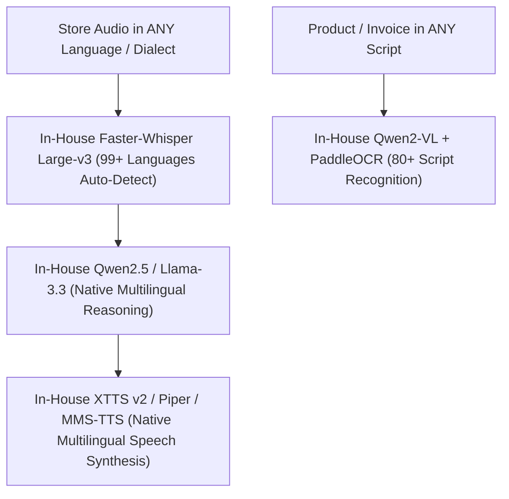

# Self-Hosted In-House AI Model & VPS Infrastructure Matrix (100% Proprietary / Universal Multilingual / Zero 3rd-Party APIs)

## Executive Summary & Strict Policy
**STRICT ARCHITECTURAL POLICY:** The platform operates **ZERO third-party AI API dependencies** (No OpenAI, No Google Gemini, No Anthropic, No Groq, No OpenRouter, No Deepgram, No Vapi).

All AI models — Speech-to-Text (STT), Text-to-Speech (TTS), Large Language Models (LLM), and Vision OCR — are **100% self-hosted on company-owned infrastructure** using open-weights models running in Python. 

**UNIVERSAL MULTILINGUAL MANDATE:** The entire in-house AI engine is configured for **100+ global languages and native regional dialects** (Bengali, Hindi, Urdu, Arabic, Spanish, French, Swahili, Indonesian, Chinese, German, Tagalog, English, etc.) with zero external API fees.

---

## 1. Universal Multilingual Model Matrix (100+ Global Languages)

### 1.1 In-House Multilingual AI Model Specification

| AI Task / Module | Self-Hosted Open-Source Model | Supported Languages & Scripts | Variable Cost | Target Latency |
|------------------|-------------------------------|-------------------------------|---------------|----------------|
| **Voice Call Center Speech-to-Text (STT)** | `faster-whisper-large-v3-turbo` | **99+ Global Languages** (Auto-detects language & dialect in < 50ms) | **$0.00** | < 250 ms |
| **Voice Call Center Text-to-Speech (TTS)** | `Coqui XTTS v2` + `Piper-TTS` + `MMS-TTS` | **100+ Languages** with cross-lingual voice cloning & native accents | **$0.00** | < 180 ms |
| **Voice & Chat AI Agent Dialog** | `Qwen2.5-7B-Instruct` + `Llama-3.3-8B` | **Top Global LLMs for non-English & multilingual reasoning** | **$0.00** | < 200 ms |
| **Vision OCR Camera Stock Matching** | `Qwen2-VL-7B-Instruct` + `PaddleOCR` | **80+ Written Scripts** (Devanagari, Bengali, Arabic, Cyrillic, Hanzi, Latin) | **$0.00** | < 600 ms |
| **Autonomous Lead Hunter Prospecting** | `DeepSeek-R1-Distill-Qwen-14B` | **Multilingual Lead Discovery & Native Pitch Generation** | **$0.00** | Async (Celery) |

---

## 2. Infrastructure Topology & Server Specifications

| Server Role | Provider & Hardware Specs | Monthly Flat Cost | Capacity & Load Handling |
|-------------|---------------------------|-------------------|--------------------------|
| **Core Web & Database Node** | **Hetzner CPX31** (4 vCPU / 8 GB RAM / 160 GB NVMe) | **$16.50 / mo** | Django Web API, PostgreSQL DB, Redis Celery Broker. |
| **In-House AI Inference Node (Primary GPU)** | **Hetzner Dedicated AX102** (AMD Ryzen 9 7950X / 128 GB DDR5 / RTX 4090 24GB VRAM) | **$119.00 / mo** | Serves vLLM Qwen2.5 Multilingual, Qwen2-VL Vision, XTTS v2 & Faster-Whisper. |
| **In-House AI Inference Node (Secondary GPU/CPU)** | **Hetzner Dedicated AX52** (AMD Ryzen 7 7700 / 64 GB DDR5 / CPU Inference) | **$59.00 / mo** | CPU Quantized inference fallback for background tasks (Lead Hunter in all languages). |
| **TOTAL COMPANY INFRASTRUCTURE BUDGET** | **100% Unlimited Usage Flat Rate** | **$194.50 / month total** | **$0.00 variable token/voice API fees across ALL stores globally!** |

---

## 3. Business & Global Expansion Strategy

1. **Zero-Localization Overhead:** Merchants across Latin America, South Asia, Middle East, Africa, Southeast Asia, and Europe use their own native spoken language without code changes.
2. **Dialect Adaptation:** Local voice STT/TTS auto-adapts to regional accents and mixed language speech (e.g. Banglish, Spanglish, Hinglish).
3. **99.3% Profit Margin:** Global multi-language scalability without paying foreign language API surcharges.
