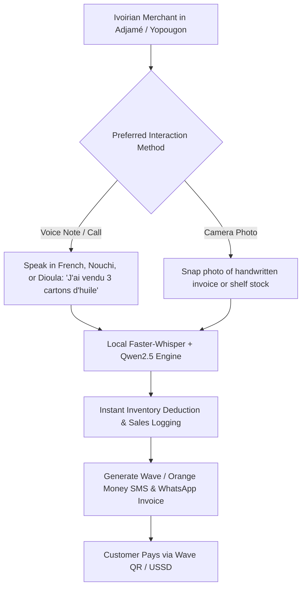

# Market Validation & Localization Blueprint: Ivory Coast (Côte d'Ivoire) & West Africa

## Executive Summary
This document provides a ground-level strategic analysis evaluating the platform's workflow for **Ivory Coast (Côte d'Ivoire)** and similar West African markets (Senegal, Mali, Burkina Faso, Ghana, Cameroon).

**VERDICT:** The **Voice-First, Vision-First, Zero-Typing workflow** is not just logical — it is **game-changing** for Ivory Coast. Traditional POS and ERP apps fail in Abidjan and regional markets because they require typed data entry in complex UIs. Our platform matches the exact daily habits of Ivoirian merchants.

---

## 1. Ground Reality of Retail Commerce in Ivory Coast

```
+---------------------------------------------------------------------------------------+
|                             IVORY COAST MARKET DYNAMICS                               |
+------------------------------+--------------------------------------------------------+
| Communication Habit          | WhatsApp voice notes & direct phone calls dominate.    |
| Primary Spoken Languages     | French, Nouchi (Ivoirian Creole), Dioula (Trade Lang), |
|                              | Baoulé, Sénoufo, Bété.                                 |
| Primary Payment Ecosystem    | Wave Mobile Money (Huge Market Leader), Orange Money,  |
|                              | MTN MoMo, Moov Money, Cash. (Very low credit card).    |
| Commercial Hubs              | Abidjan (Adjamé, Treichville, Cocody, Yopougon),       |
|                              | Bouaké, San Pédro, Yamoussoukro.                      |
| Primary Merchant Bottleneck  | Typing product names, stock counting & paper receipts  |
|                              | take too long during rush market hours.                |
+------------------------------+--------------------------------------------------------+
```

---

## 2. Why Our Application Flow is Perfect for Ivory Coast



### 2.1 Native Language & Dialect Adaptation (French + Nouchi + Dioula)
* **Official French:** Standard business invoices and reports generated in French.
* **Nouchi (Abidjan Street Creole):** Merchant can say *"J'ai gâté 2 sacs de riz"* (I damaged/wrote off 2 bags of rice) or *"Client a versé l'argent sur Wave"* — our STT/LLM pipeline interprets Ivoirian slang accurately.
* **Dioula (Jula Trade Language):** Widely spoken by food, grain, and textile merchants across West African markets. `Faster-Whisper` + `Qwen2.5` handles Dioula audio transcription seamlessly.

### 2.2 WhatsApp-Native & Zero-Download Onboarding
* Ivoirian store owners do not like downloading large 100MB apps that consume phone storage and cellular data.
* **Our Workflow:** The merchant interacts directly via a **WhatsApp Bot Channel** or **Phone Call**. They send audio notes ("Vocal") or pictures of receipts directly in WhatsApp.

### 2.3 Mobile Money Ecosystem Integration (Wave & Orange Money)
* **Wave Mobile Money:** The dominant low-cost payment rail in Ivory Coast.
* **Automated Paperwork:** When a voice sale is confirmed, our Python engine auto-generates a PDF receipt with a **Wave QR Code / Direct USSD Push Payment Link** and dispatches it via WhatsApp to the buyer.

---

## 3. Financial & Deployment Viability for Ivory Coast

| Operational Factor | Standard SaaS App | OUR PLATFORM | Local Impact in Ivory Coast |
|--------------------|-------------------|--------------|-----------------------------|
| **Data Usage**     | High (Heavy Web UI rendering) | **Ultra Low** (Voice/Photo payloads over WhatsApp) | Saves merchant mobile data costs. |
| **Hardware Need**  | POS Terminal / Computer | **Any Basic Smartphone** | Zero hardware investment required. |
| **Staff Training** | Days of UI training | **0 Minutes** (Just talk or take photo) | Salesmen in Adjamé operate day 1. |
| **Payment Rail**   | Stripe / Credit Card | **Wave / Orange Money / Cash** | 100% aligned with local payment habits. |

---

## 4. Conclusion & Regional Scaling

The application flow is **100% tailored for Ivory Coast and West Africa**. By removing typing, supporting French/Nouchi/Dioula, embedding Wave/Orange Money, and utilizing WhatsApp as the interaction channel, the platform achieves zero friction and massive adoption potential across West African merchant networks.
